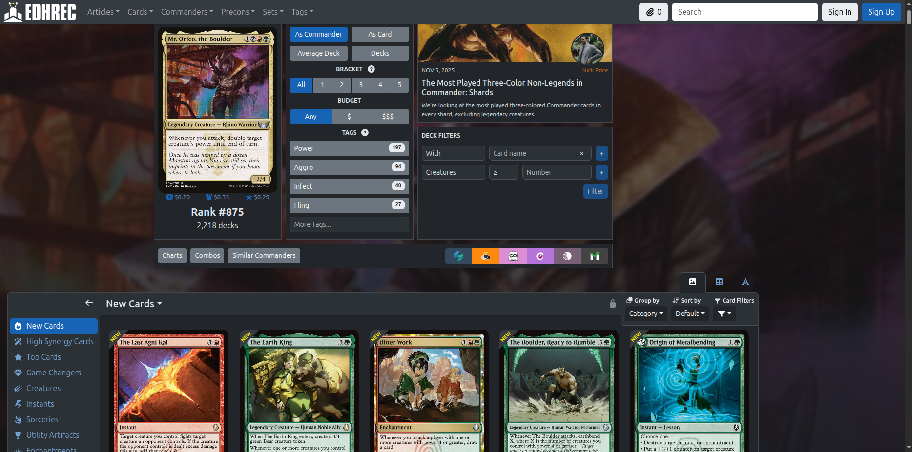
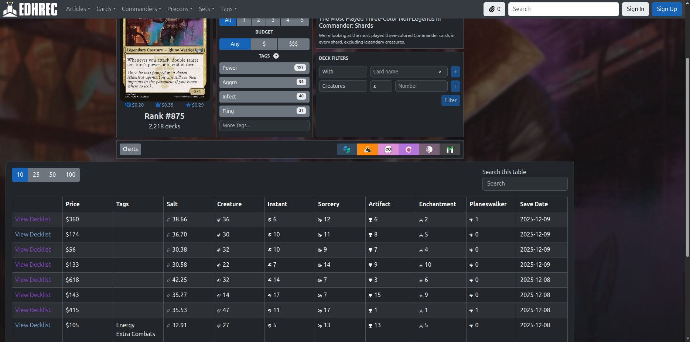
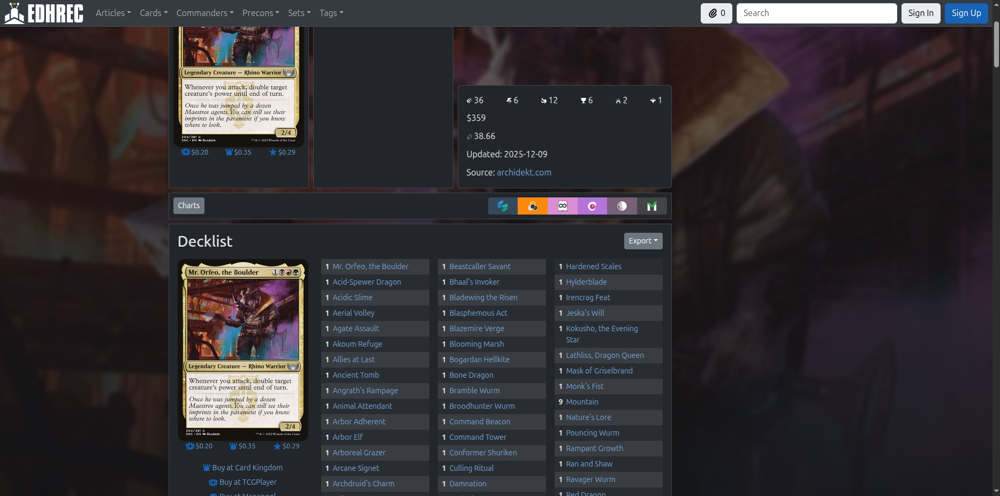
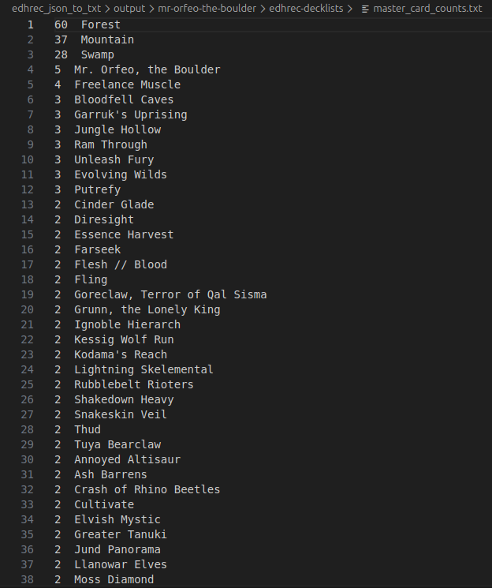

# EDHRec Deck Building Scripts

These Python programs are aimed at helping deckbuilders follow trends for building their EDH/Commander decks. The scripts get cardlists for a given commander from EDHRec and save them as text files that can be uploaded to sites like Moxfield, Archidekt, MPC Autofill, etc.

## Setup and Example

```shell
user@pc:~$ python3 -m venv venv-magic-script
user@pc:~$ source venv-magic-scripts/bin/activate
(venv-magic-scripts) user@pc:~$ pip install requests
(venv-magic-scripts) user@pc:~$ pip install tqdm
```

## Usage - EDHRec Recommendations

```shell
(venv-magic-scripts) user@pc:~$ python3 edhrec_json_to_txt.py 
In format_commander_name and formatted name is mr-orfeo-the-boulder
In format_commander_name and formatted name is mr-orfeo-the-boulder
JSON request successful!
Commander saved to file ./output/mr-orfeo-the-boulder/edhrec-suggestions/Commander.txt
New Cards saved to file ./output/mr-orfeo-the-boulder/edhrec-suggestions/New Cards.txt
High Synergy Cards saved to file ./output/mr-orfeo-the-boulder/edhrec-suggestions/High Synergy Cards.txt
Top Cards saved to file ./output/mr-orfeo-the-boulder/edhrec-suggestions/Top Cards.txt
Game Changers saved to file ./output/mr-orfeo-the-boulder/edhrec-suggestions/Game Changers.txt
Creatures saved to file ./output/mr-orfeo-the-boulder/edhrec-suggestions/Creatures.txt
Instants saved to file ./output/mr-orfeo-the-boulder/edhrec-suggestions/Instants.txt
Sorceries saved to file ./output/mr-orfeo-the-boulder/edhrec-suggestions/Sorceries.txt
Utility Artifacts saved to file ./output/mr-orfeo-the-boulder/edhrec-suggestions/Utility Artifacts.txt
Enchantments saved to file ./output/mr-orfeo-the-boulder/edhrec-suggestions/Enchantments.txt
Planeswalkers saved to file ./output/mr-orfeo-the-boulder/edhrec-suggestions/Planeswalkers.txt
Utility Lands saved to file ./output/mr-orfeo-the-boulder/edhrec-suggestions/Utility Lands.txt
Mana Artifacts saved to file ./output/mr-orfeo-the-boulder/edhrec-suggestions/Mana Artifacts.txt
Lands saved to file ./output/mr-orfeo-the-boulder/edhrec-suggestions/Lands.txt
Flat Cardlist saved to file ./output/mr-orfeo-the-boulder/edhrec-suggestions/Flat Cardlist.txt
infos['Card Counts'] = {'Commander': 1, 'New Cards': 5, 'High Synergy Cards': 10, 'Top Cards': 10, 'Game Changers': 1, 'Creatures': 50, 'Instants': 40, 'Sorceries': 34, 'Utility Artifacts': 13, 'Enchantments': 22, 'Planeswalkers': 2, 'Utility Lands': 13, 'Mana Artifacts': 13, 'Lands': 50, 'Flat Cardlist': 264}

Want to make reduced lists? y/n: n
(venv-magic-scripts) user@pc:~$ 
```

## Usage - EDHRec Decklist Statistics

Edit `commander.txt` with your commander you want to search for. The name should be the official card name

Example: `Mr. Orfeo, the Boulder`

```shell
(venv-magic-scripts) user@pc:~$ python3 edhrec_decklists_json_to_txt.py 
Output directory cleaned: ./output/mr-orfeo-the-boulder/edhrec-decklists-compilation
Commander is:  Mr. Orfeo, the Boulder
How many recent decks to use?: 5
Minimum deck price?: 1
Maximum deck price?: 100
Using 5 deck hashes: ['cJI77Fb1D12YVfic6BSeIA', '0d12VwcQATaT8syoJ5MbyA', 'YBUbiml0nTPUmz4jC1yA6A', 'CU5Byefsf8zIf71IbvbhRg', 'wGxvXBvjVX5c3l6tofV_VQ']
Downloading decks: 100%|████████████████████████████████████████████████████████| 5/5 [00:00<00:00, 99391.09it/s]
Decklists saved to output/mr-orfeo-the-boulderdecklists.txt
Classifying card types: 100%|█████████████████████████████████████████████| 312/312 [00:00<00:00, 1953168.43it/s]
Master card count and type lists saved in ./output/
(venv-magic-scripts) user@pc:~$ 
```

## Outputs

The outputs folder stores text files geenrated by running the scripts. The text files can be easily imported into online deck builders. The outputs folder will store the results for the latest runs. Subsequent script runs for the same commander delete the previous run's data and gather fresh data. This can be disabled by commenting out the `clean_output_directories(formatted_name)` function call in the main function of the `edhrec_decklists_json_to_txt.py` script.

### EDHRec Suggestions

The `edhrec_json_to_txt.py` script takes card suggestion categories you see when browsing the EDHRec website and organizes those cards into text files.



```shell
(venv-magic-scripts) user@pc:~$ tree output/
output/
└── mr-orfeo-the-boulder
    ├── edhrec-decklists
    └── edhrec-suggestions
        ├── Commander.txt
        ├── Creatures.txt
        ├── Enchantments.txt
        ├── Flat Cardlist.txt
        ├── Game Changers.txt
        ├── High Synergy Cards.txt
        ├── Info.txt
        ├── Instants.txt
        ├── Lands.txt
        ├── Mana Artifacts.txt
        ├── New Cards.txt
        ├── Planeswalkers.txt
        ├── Sorceries.txt
        ├── Top Cards.txt
        ├── Utility Artifacts.txt
        └── Utility Lands.txt

4 directories, 16 files
```

### EDHRec Decklists Statistics

The `edhrec_decklists_json_to_txt.py` script is a bit more involved and aggregates data that EDHRec pulls from different decklist sites. The decks can be filtered down with a budget range and by the most recent X number decks, specified at script runtime. The advantage of this script is data is aggregated into text files instead of having to click through each decklist on the EDHRec website.





```shell
(venv-magic-scripts) user@pc:~$ tree output/
output/
└── mr-orfeo-the-boulder
    ├── edhrec-decklists
    │   ├── cards_artifact.txt
    │   ├── cards_creature.txt
    │   ├── cards_enchantment.txt
    │   ├── cards_instant.txt
    │   ├── cards_land.txt
    │   ├── cards_planeswalker.txt
    │   ├── cards_sorcery.txt
    │   ├── master_card_counts.txt
    │   └── mr-orfeo-the-boulder-decklists.txt
    └── edhrec-suggestions

4 directories, 9 files
```

In this example, the statistics are from the latest 5 decks between budgets of $1 and $100. The output of the `master_card_counts.txt` file shows the top most commonly used cards to make a deck using Mr. Orfro, the Boulder and how many times the specific card appeared in those 5 decks (hence why so many basic lands). The various card types are also sorted into separate files, in case you're looking for specific card types.



```shell
(venv-magic-scripts) user@pc:~$ head -20 output/mr-orfeo-the-bou
lder/edhrec-decklists/master_card_counts.txt 
60  Forest
37  Mountain
28  Swamp
5  Mr. Orfeo, the Boulder
4  Freelance Muscle
3  Bloodfell Caves
3  Garruk's Uprising
3  Jungle Hollow
3  Ram Through
3  Unleash Fury
3  Evolving Wilds
3  Putrefy
2  Cinder Glade
2  Diresight
2  Essence Harvest
2  Farseek
2  Flesh // Blood
2  Fling
2  Goreclaw, Terror of Qal Sisma
2  Grunn, the Lonely King
```

## Cache

The `edhrec_decklists_json_to_txt.py` script is set up to pull EDHRec decklists for the specified commander and store them locally in a cache directory folder. The EDHRec decklists are stored by their unique urlhash, or DeckID that can be seen when browsing the EDHRec website. It also pulls scryfall data and caches it locally, giving each card a primary card type label for the sorting functionality.

### Cache directory structure

```shell
(venv-magic-scripts) user@pc:~$ tree -L 2 cache/
cache/
├── deck_cache
│   ├── 0d12VwcQATaT8syoJ5MbyA.json
│   ├── cJI77Fb1D12YVfic6BSeIA.json
│   ├── CU5Byefsf8zIf71IbvbhRg.json
│   ├── wGxvXBvjVX5c3l6tofV_VQ.json
│   └── YBUbiml0nTPUmz4jC1yA6A.json
└── scryfall_cache.json

2 directories, 6 files
```

### Deck cache file structure

```shell
(venv-magic-scripts) user@pc:~$ head -10 cache/deck_cache/0d12Vw
cQATaT8syoJ5MbyA.json 
[
  "1 Mr. Orfeo, the Boulder",
  "1 Abnormal Endurance",
  "1 Aloe Alchemist",
  "1 Anzrag, the Quake-Mole",
  "1 Ashnod's Intervention",
  "1 Bloodfell Caves",
  "1 Boar Umbra",
  "1 Bojuka Bog",
  "1 Bulk Up",
```

### Scryfall data cache structure

```shell
(venv-magic-scripts) user@pc:~$ head -10 cache/scryfall_cache.json 
{
  "Mr. Orfeo, the Boulder": "Legendary Creature \u2014 Rhino Warrior",
  "Angry Rabble": "Creature \u2014 Human Citizen",
  "Annoyed Altisaur": "Creature \u2014 Dinosaur",
  "Arcane Signet": "Artifact",
  "Ash Barrens": "Land",
  "Audacious Thief": "Creature \u2014 Human Rogue",
  "Bellowing Elk": "Creature \u2014 Elk",
  "Bender's Waterskin": "Artifact",
  "Big Score": "Instant",
```

## Leaving the Python Venv

```shell
(venv-magic-scripts) user@pc:~$ deactivate
user@pc:~$
```
